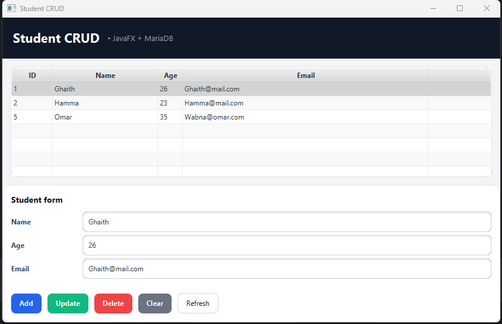

# StudentCRUD (JavaFX + MariaDB)

A simple **CRUD desktop application** built with **JavaFX (Scene Builder)** and **MariaDB (XAMPP)** using a clean **DAO + JDBC** architecture.



---

## ✨ Features

- ✅ Display students in a `TableView`
- ✅ Add / Update / Delete a student
- ✅ Refresh table from database
- ✅ Click a row → form auto-fills
- ✅ Modular JavaFX project (`module-info.java`)
- ✅ DAO layer (clean separation UI ↔ DB)
- ✅ **WhatsApp notification when a student is added** 📲
- ✅ **Email notification sent to the student on registration** 📧
- ✅ Email & duplicate validation (DB + UI)
- ✅ Status feedback inside the UI (success / error messages)

---

## 🧰 Tech Stack

- **Java**: JDK 21+
- **JavaFX**: 21.0.6
- **Build Tool**: Maven
- **Database**: MariaDB (XAMPP)
- **JDBC Driver**: MariaDB Connector/J
- **UI Builder**: Scene Builder
- **Messaging API**: CallMeBot (WhatsApp)
- **Email API**: EmailJS

---

## 📁 Project Structure


```
src/main/java/com/esprit/studentcrud/
├── controller/        # JavaFX controllers
├── dao/               # DAO interface + implementation
├── model/             # Entity classes (Student)
├── util/              # DBConnection, WhatsAppService, EmailJsService
├── MainApp.java       # JavaFX Application entry
└── Launcher.java      # main() entry

src/main/resources/com/esprit/studentcrud/
├── students-view.fxml # JavaFX view (Scene Builder)
├── style.css          # Application styling

````

---

## ✅ Prerequisites

- Java JDK installed
- Maven installed (or IntelliJ Maven support)
- **XAMPP** installed and MySQL/MariaDB service running
- **WhatsApp** installed (for API notifications)
- **EmailJS account** (for email notifications)

---

## 🗄️ Database Setup

### 1️⃣ Start XAMPP
- Open XAMPP Control Panel
- Start **MySQL**

### 2️⃣ Create database and table

```sql
CREATE DATABASE IF NOT EXISTS school;
USE school;

CREATE TABLE IF NOT EXISTS students (
  id INT PRIMARY KEY AUTO_INCREMENT,
  name VARCHAR(100) NOT NULL,
  age INT NOT NULL,
  email VARCHAR(120) NOT NULL UNIQUE
);
````
```
---

## 🔌 Database Connection Configuration

Edit this file if your DB credentials change:

```
src/main/java/com/esprit/studentcrud/util/DBConnection.java
```

```java
private static final String URL = "jdbc:mariadb://localhost:3306/school";
private static final String USER = "root";
private static final String PASSWORD = "";
```

---

## 🧠 Architecture Overview

```
FXML → Controller → DAO → Database
                        ↳ WhatsApp API
                        ↳ EmailJS API
```

* Clean separation of concerns
* External APIs isolated in `util`
* Easily extensible (login, roles, SMTP, REST…)

---

## 📲 WhatsApp API Integration (CallMeBot)


The application sends a **WhatsApp message** whenever a new student is added.

### 🔐 Step 1 — Phone Activation

1. Add this number to your contacts:
   **+34 623 76 13 63**

2. Send this message on WhatsApp:

```
I allow callmebot to send me messages
```

3. Receive your API key:

```
API Activated for your phone number.
Your APIKEY is XXXXXXX
```

---

### ⚙️ Step 2 — WhatsApp Service

Logic is isolated in:

```
src/main/java/com/esprit/studentcrud/util/WhatsAppService.java
```

* Uses Java `HttpClient`
* Runs asynchronously to avoid freezing the UI

---

### 🔔 Trigger WhatsApp Notification

Triggered automatically after inserting a student:

```
New student added:
Name
Age
Email
```

---

## 📧 Email Notification (EmailJS)


When a student is successfully added, the application sends a **confirmation email to the student**.

---

### 🧩 Step 1 — EmailJS Setup

1. Create an account at [https://www.emailjs.com](https://www.emailjs.com)
2. Create:

   * Email Service
   * Email Template
3. Template variables used:

   * `{{student_name}}`
   * `{{student_age}}`
   * `{{student_email}}`

The template is **HTML-based** and styled for professional emails.

---

### 🔐 Step 2 — Environment Variables (.env)

Sensitive credentials are stored in a `.env` file (ignored by Git):

```env
EMAILJS_SERVICE_ID=your_service_id
EMAILJS_TEMPLATE_ID=your_template_id
EMAILJS_PUBLIC_KEY=your_public_key
WHATSAPP_PHONE=216XXXXXXXX
WHATSAPP_API_KEY=XXXXXXXX
```

> `.env` is added to `.gitignore` to prevent leaks.

---

### ⚙️ Step 3 — EmailJsService

Email logic is encapsulated in:

```
src/main/java/com/esprit/studentcrud/util/EmailJsService.java
```

Responsibilities:

* Read values from `.env`
* Call EmailJS REST API
* Send HTML email asynchronously

---

### 📬 Step 4 — Trigger Email on Add

When a student is added:

* Database insert
* UI refresh
* WhatsApp notification
* **Email sent to the student**

Status feedback is displayed inside the UI:

* ✅ Success (green)
* ❌ Error (red)

---

## ▶️ Run the Application

```bash
mvn clean javafx:run
```

---

## 🧪 Common Issues

### ❌ Table shows rows but cells are empty

* Ensure `cellValueFactory` is set
* Ensure getters exist in `Student`

### ❌ Buttons disabled

* Update/Delete enabled only when a row is selected

### ❌ Email not sent

* Check EmailJS credentials
* Check template variable names

---

## 👤 Author

**Ghaith — ESPRIT**

---

## 🔥 Future Improvements

* In-app notifications
* Search bar
* Export data (CSV / PDF)
