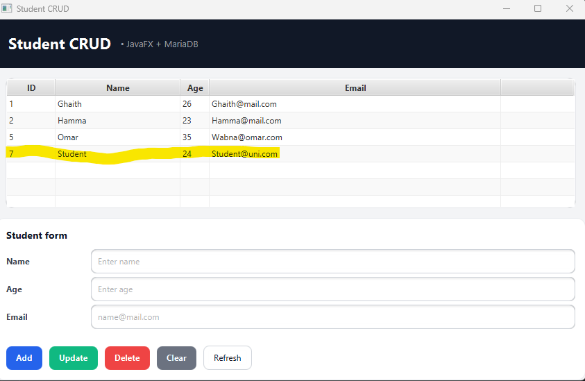
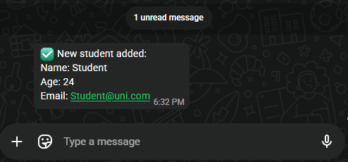

# StudentCRUD (JavaFX + MariaDB)

A simple **CRUD desktop application** built with **JavaFX (Scene Builder)** and **MariaDB (XAMPP)** using a clean **DAO + JDBC** architecture.


---

## ✨ Features

- ✅ Display students in a `TableView`
- ✅ Add / Update / Delete a student
- ✅ Refresh table from database
- ✅ Click a row → form auto-fills
- ✅ Modular JavaFX project (`module-info.java`)
- ✅ DAO layer (clean separation UI ↔ DB)
- ✅ **WhatsApp notification when a student is added** 📲

---

## 🧰 Tech Stack

- **Java**: JDK 21+
- **JavaFX**: 21.0.6
- **Build Tool**: Maven
- **Database**: MariaDB (XAMPP)
- **JDBC Driver**: MariaDB Connector/J
- **UI Builder**: Scene Builder
- **Messaging API**: CallMeBot (WhatsApp)

---

## 📁 Project Structure


```

src/main/java/com/esprit/studentcrud/
├── controller/ # JavaFX controllers
├── dao/ # DAO interface + implementation
├── model/ # Entity classes (Student)
├── util/ # DBConnection, WhatsAppService
├── MainApp.java # JavaFX Application entry
└── Launcher.java # main() entry

src/main/resources/com/esprit/studentcrud/
└── students-view.fxml # JavaFX view (Scene Builder)

````

---

## ✅ Prerequisites

- Java JDK installed
- Maven installed (or IntelliJ Maven support)
- **XAMPP** installed and MySQL/MariaDB service running
- **WhatsApp** installed on your phone (for API notifications)


---

## 🗄️ Database Setup

### 1️⃣ Start XAMPP
- Open XAMPP Control Panel
- Start **MySQL**

### 2️⃣ Create database and table

```sql
CREATE DATABASE IF NOT EXISTS school;
USE school;

CREATE TABLE IF NOT EXISTS students (
  id INT PRIMARY KEY AUTO_INCREMENT,
  name VARCHAR(100) NOT NULL,
  age INT NOT NULL,
  email VARCHAR(120) NOT NULL
);
````

(Optional) Insert test data:

```sql
INSERT INTO students(name, age, email) VALUES
('Ghaith', 26, 'Ghaith@mail.com'),
('hamma', 22, 'hamma@mail.com');
```

---

## 🔌 Database Connection Configuration

Edit this file if your DB credentials change:

```
src/main/java/com/esprit/studentcrud/util/DBConnection.java
```

```java
private static final String URL = "jdbc:mariadb://localhost:3306/school";
private static final String USER = "root";
private static final String PASSWORD = "";
```
---

## 🧠 Architecture Overview

```
FXML → Controller → DAO → Database → WhatsApp API

Clean separation of concerns

External API isolated in util

Easily extensible (email, REST, auth…)

```

## 🧪 Common Issues

### ❌ “No controller specified”

Ensure the FXML root contains:

```xml
fx:controller="com.esprit.studentcrud.controller.StudentController"
```

### ❌ Table shows rows but cells are empty

* Ensure `cellValueFactory` is set in the controller
* Ensure `Student` getters exist (`getName()`, `getAge()`, etc.)


---

## 📲 WhatsApp API Integration (CallMeBot)


This application can automatically send **WhatsApp messages** whenever a new student is added to the database.  
The integration is done using the **CallMeBot WhatsApp API**.

---

### 🔐 Step 1 — Activate CallMeBot on Your Phone

1. Add this number to your contacts:
   **+34 623 76 13 63**

2. Send this message on WhatsApp:
```
I allow callmebot to send me messages
```

3. Receive your API key:
```
API Activated for your phone number.
Your APIKEY is XXXXXXX
```

⚠️ If not received in 2 minutes, retry later.

---

### ⚙️ Step 2 — Configure the API in the Application

```java
package com.esprit.studentcrud.util;

import java.net.URI;
import java.net.URLEncoder;
import java.net.http.HttpClient;
import java.net.http.HttpRequest;
import java.net.http.HttpResponse;
import java.nio.charset.StandardCharsets;

public class WhatsAppService {

    private static final String PHONE = "216XXXXXXXX";
    private static final String API_KEY = "YOUR_API_KEY";

    public static void sendMessage(String message) {
        try {
            String encoded = URLEncoder.encode(message, StandardCharsets.UTF_8);
            String url = "https://api.callmebot.com/whatsapp.php?phone="
                    + PHONE + "&text=" + encoded + "&apikey=" + API_KEY;

            HttpClient.newHttpClient()
                    .sendAsync(
                        HttpRequest.newBuilder().uri(URI.create(url)).GET().build(),
                        HttpResponse.BodyHandlers.ofString()
                    );
        } catch (Exception e) {
            e.printStackTrace();
        }
    }
}
```

Add to `module-info.java`:
```java
requires java.net.http;
```

---

### 🔔 Step 3 — Trigger Message on Add

```java
WhatsAppService.sendMessage(
    "📚 New student added:\n" +
    "👤 Name: " + s.getName() + "\n" +
    "🎂 Age: " + s.getAge() + "\n" +
    "📧 Email: " + s.getEmail()
);
```

---

## ▶️ Run the Application

```bash
mvn clean javafx:run
```
## ✅ Add a Student


---
## 🚀 Message Recieved


---
## 👤 Author

* **Ghaith** — ESPRIT

---
## 🔥 Future Improvements

* Login & authentication system

* Email format validation (Google SMTP)

* User roles (Admin / User)
